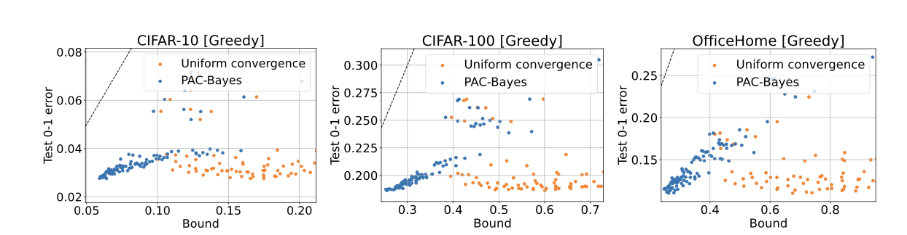
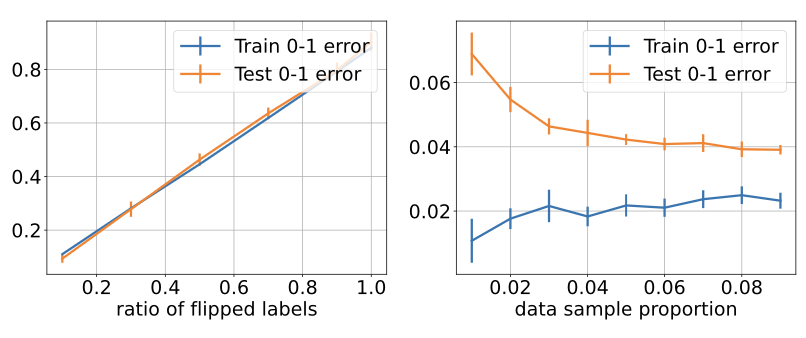

# Understanding prompt engineering does not require rethinking generalization (writing skills)

**TL;DR:** When learning over discrete prompts, classical PAC-Bayes bounds turn out to be remarkably tight — significantly tighter than prior PAC-Bayes results on deep networks.

If you've ever tinkered with a large vision-language model (VLM), you might have noticed something odd. You can "engineer" a prompt — maybe even over-optimize it to your training data — and it still works well on the test set.

Wait, what? Isn't that overfitting? Shouldn't the test performance crash?

Surprisingly, it doesn't. In this post, we'll explore *why prompt engineering tends to generalize*, even when it seems like it shouldn't — and how a classic theory of generalization (PAC-Bayes) gives us a satisfying explanation.

In zero-shot learning, we use **natural language prompts** (like “a photo of a dog”) to guide models like CLIP (Contrastive Language–Image Pretraining) in making predictions. No fine-tuning, no labeled training — just cleverly chosen phrases.

CLIP is a vision-language model trained to align images and text in a shared embedding space. Formally, CLIP consists of two encoders:

CLIP consists of two encoders:

- An image encoder: $f_{img}: \mathcal{X} \rightarrow \mathbb{R}^d$
- A text encoder: $f_{text}: \mathcal{T} \rightarrow \mathbb{R}^d$

Given a batch of image–text pairs $\{(x_i, t_i)\}_{i=1}^N$, CLIP is trained using a contrastive loss to maximize the cosine similarity between corresponding image and text embeddings:

$$
L = -\frac{1}{N} \sum_{i=1}^{N} \log \left[
  \frac{\exp\left(\langle f_{img}(x_i), f_{text}(t_i) \rangle / \tau \right)}
       {\sum_{j=1}^{N} \exp\left(\langle f_{img}(x_i), f_{text}(t_j) \rangle / \tau \right)}
\right]
$$

Where $\langle \cdot, \cdot \rangle$ denotes **cosine similarity**, and $\tau$ is a **temperature parameter**.

---

**Inference (Zero-shot Classification)**

At inference time, for each class label $k$, we define a natural language prompt $t_k \in \mathcal{T}$ (e.g., `"a photo of a cat"`). To classify an image $x$, we compute:

$$
\hat{y} = \arg\max_k \langle f_{img}(x), f_{text}(t_k) \rangle
$$

This allows CLIP to perform classification tasks **without labeled training data**, using only the **textual descriptions** of the classes.

The central puzzle: if we optimize prompts on training data (e.g., via greedy search), why don't we overfit? And can we predict how well a prompt will do on test data?

The answer lies in applying PAC-Bayes theory to the **space of discrete text prompts**. This isn't new theory — it's a classical tool that provides generalization guarantees by balancing:

- How well a model fits the training data (empirical risk), and
- How "simple" or "expected" it is, under a prior (Occam's razor).

---
**Framing Prompt Engineering as Learning**

In our [paper](#paper), we adapt this to prompt engineering:

- **Hypotheses = prompts.** Each prompt defines a classifier. The space of prompts is discrete (a finite set of token sequences).
- **Prior = a language model.** The prior over prompts is given by a pretrained LLM like LLaMA-7B, which assigns higher probability to natural, coherent text sequences.
- **Posterior = a chosen prompt.** The selected prompt is treated as a point mass (a deterministic choice).

With this setup, the PAC-Bayes bound becomes a concrete, computable upper bound on the expected test error of a prompt, based on its training error and its **log-probability under the language model**.

This turns the generalization problem into one of **regularized search**: find prompts that fit the data and are likely under the language model.

**A Classical Bound That Works in Practice**

Let's write the bound more precisely. Given a prior $P(\theta)$ over prompts $\theta$, and a learned prompt $\hat{\theta}$, the PAC-Bayes bound states (adapted from [McAllester 1999](#mcallester)):

$R(\hat{\theta}) \leq r(\hat{\theta}) + \frac{ \mathrm{KL}(\hat{\theta} \parallel P) + \log\left(\frac{1}{\delta}\right) + 2 }{2n - 1}$

Where:

- $R(\hat{\theta})$ is the expected test error,
- $r(\hat{\theta})$ is the empirical (training) error,
- $KL$ is the Kullback–Leibler divergence between the posterior (a point mass) and the prior,
- $n$ is the number of training samples,
- $\delta$ is a confidence parameter.

In the case of a point-mass posterior, the KL term reduces to the negative log-probability of the prompt under the prior. This makes it computable and interpretable.

**Tight Bounds in Practice**

 **[Caption: Test error vs. PAC-Bayes bound for prompts on CIFAR-10, CIFAR-100, and OfficeHome datasets. The data points lie close to the y = x line, showing tight correspondence.]**

When this approach is applied in practice, the results are surprising. Across datasets like CIFAR-10, CIFAR-100, and ImageNet, the PAC-Bayes bounds are not only non-vacuous — they are remarkably **tight**, sometimes within **2–6%** of the actual test error. For instance, on CIFAR-10, a prompt found via greedy search has a training error of 2.3%, a test error of 2.8%, and a PAC-Bayes bound of just 8.6%. On ImageNet, with a much larger class set, the bound is still within 6% of the test error.

This level of tightness is exceptional in the context of deep learning, where most generalization bounds are either loose or vacuous.

Importantly, these bounds are computed **without needing data-dependent priors**, that is we don't use a validation set to improve the prior - just using a language model prior and a discrete prompt space suffices.

**Why Don't Prompts Overfit?**

Unlike neural network weights, prompts are selected from a **small, structured, and discrete** space — the set of token sequences. Even if this space is searched greedily to reduce training error, the language model prior inherently favors natural, compressible prompts. These priors act as **soft inductive biases**, gently guiding search toward hypotheses that generalize.

**[Caption:We show that as the proportion of random labels increases, both training and test accuracy of prompts degrade together.]**
**[Caption: We show that a greedy prompt learning on CIFAR-10 yields small generalization error even with small sample sizes.]**

The robustness of this behavior is further illustrated when training labels are corrupted. The test accuracy of prompts drops smoothly along with training accuracy, suggesting that prompt engineering is **resistant to memorizing noise** — unlike large neural nets, which can often fit random labels with zero training loss.

**A Model Selection Tool**

**The prompts with the tightest PAC-Bayes bounds tend to have the best test performance**. This makes the bound useful not just for analysis, but also for **prompt selection**. When multiple prompts perform similarly on the training set, we can pick the one with the smallest bound — effectively combining empirical fit with a regularization term. In addition, when the number of data points is small (e.g., n = 20), the use of PAC-Bayes is especially attractive since can use all the data points to estimate the posterior and bound its risk. In contrast to typical deep learning bounds, which degrade rapidly with small sample sizes, With only 20 labeled examples per class on CIFAR-10, the PAC-Bayes bounds are still non-vacuous.

**Conclusion: Prompt Engineering is Theoretically Sound**

Prompt engineering is not just a practical hack — it's a well-founded method with provable generalization guarantees. The use of pretrained language models as priors, combined with the discrete structure of prompts, enables PAC-Bayes bounds that are tighter than anything previously achieved in large-scale vision tasks.

**Reference**

<a name="paper">Victor Akinwande, Yiding Jiang, Dylan Sam, J. Zico Kolter. Understanding prompt engineering may not require rethinking generalization. ICLR 2024 </a>

<a name="mcallester">David A McAllester. Pac-bayesian model averaging. In Proceedings of the twelfth annual conference on Computational learning theory, pp. 164–170, 1999 </a>
